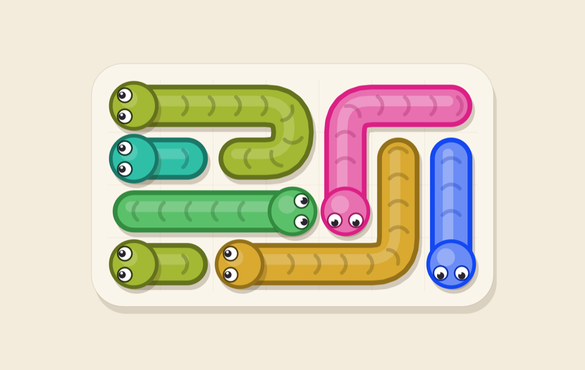
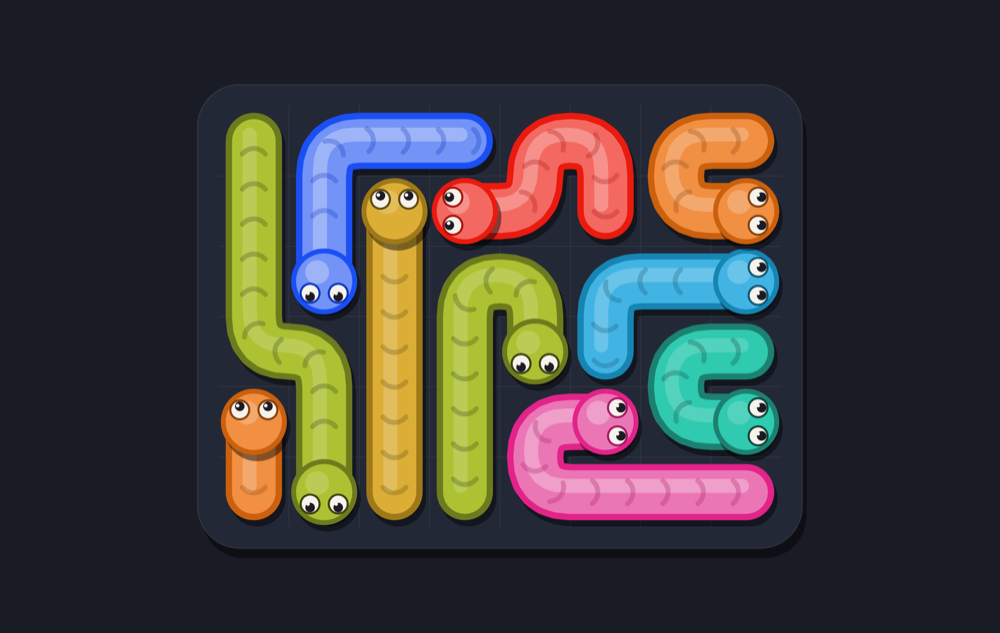
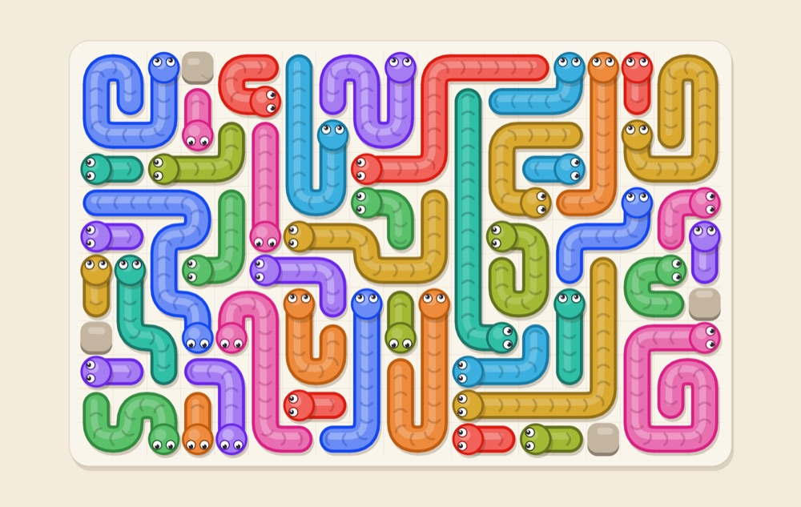
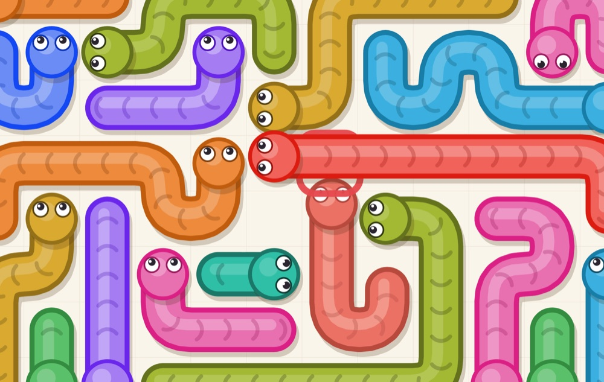
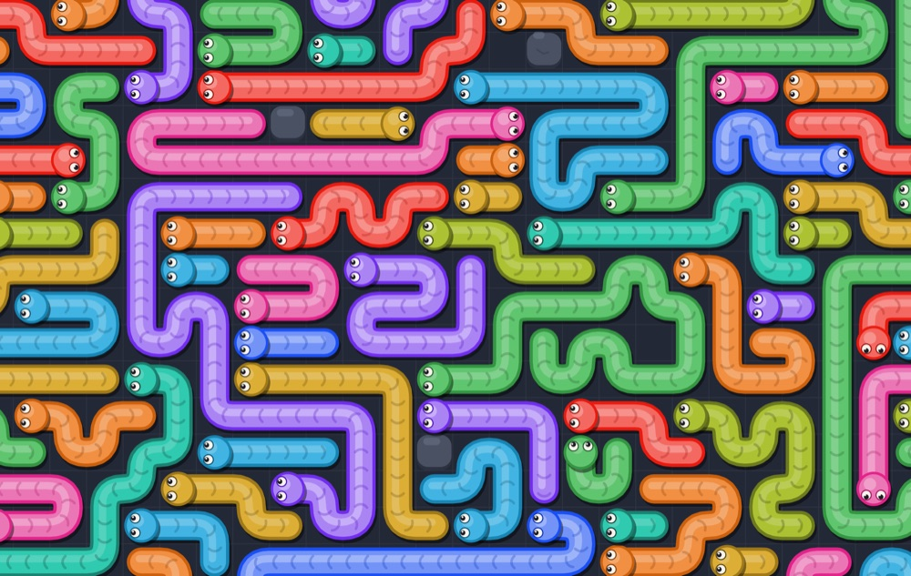
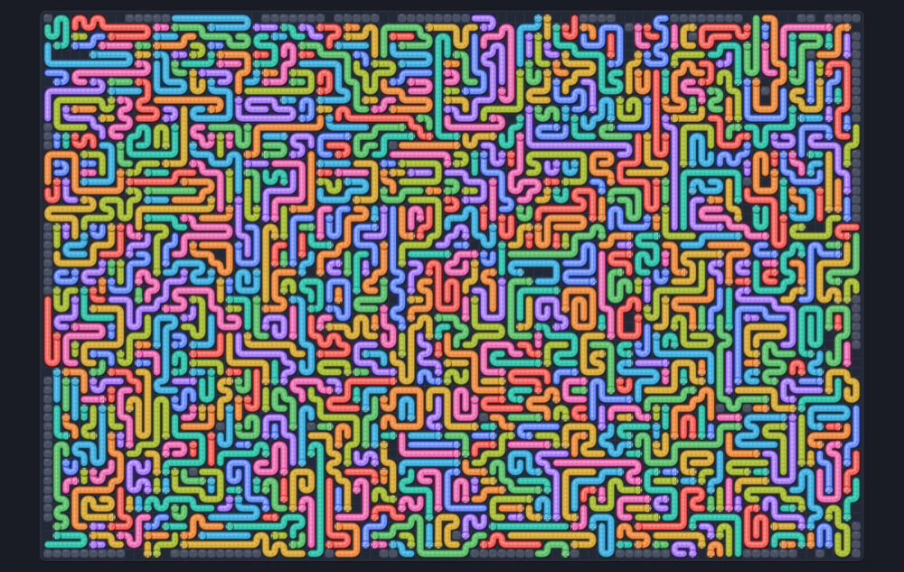
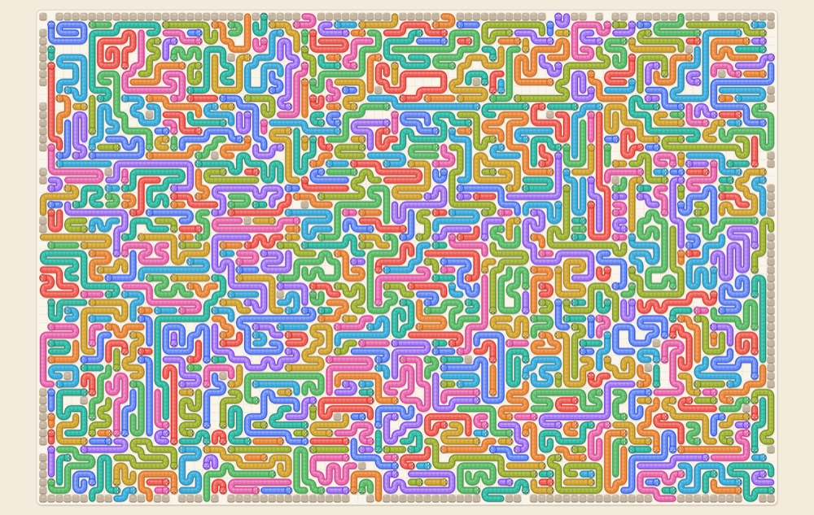

# Klubok

[English](#english) · [Русский](#русский)

## English

A puzzle about tangled snakes. Tap a snake and it slithers straight ahead and off the board.
If another snake or a rock is in the way, it bumps and you lose a life. Three lives per level.
Clear the whole board.

Plain JavaScript, no build step, no dependencies. Works offline as a PWA on tablets and phones,
plays with mouse and wheel on desktop, hosted on GitHub Pages.



### How to play

- Tap or click any cell of a snake. It moves head-first to the edge, the body follows.
- If the line in front of the head is blocked, the snake bumps, flashes red and slides back; a heart goes out.
- You can tap several snakes in a row, they leave at the same time. A tap that is blocked only by a snake
  that is already leaving is delayed instead of punished.
- Zoom: pinch, mouse wheel, double tap on an empty spot, or the panel buttons.
  Keys: `+`, `-`, `0` (fit the board), `R` (restart).
- Levels are endless, progress is saved on the device. Tap the level number to jump to any level.
  Light theme, dark theme, or follow the system.

### Screenshots

| Level 12, dark theme | Level 60 |
|---|---|
|  |  |

| Bumping into another snake | Level 500, zoomed in |
|---|---|
|  |  |

Late levels: 90×60 cells, 600–750 snakes, rock walls along the border with a few gaps.





### How difficulty grows

- Up to level 150 the board, the number and length of snakes, the number of bends and the share of blocked
  exit lines all grow.
- The board caps at 90 cells wide; after that the structure tightens. From level 40 rock walls with gaps appear
  along the border, by level 800 almost the whole perimeter is closed. The gaps are the exits, so exit lines
  funnel into a few spots and the "who leaves first" chains grow past a hundred snakes.
- The number of snakes that are free from the start is pushed down on purpose: 13–30 out of 600–750 on big boards.
- Every level is solvable by construction: the generator keeps the exit-order graph acyclic.
  Level N is always the same level on the same device.

### Run locally

Any static server works; ES modules do not load from `file://`.

```bash
python3 -m http.server 8080
```

Open `http://localhost:8080`. URL parameters:

- `?level=40` opens level 40;
- `?dev` disables the service worker and exposes `window.__klubok` for console debugging.

### Tests and generator tooling

```bash
npm test                       # node --test: generation, movement simulation, solver, difficulty
npm run bench                  # generation stats per level: fill, rocks, free snakes, timing
node tools/show.js 30 1.33     # level 30 as ASCII with the solve order (args: level, aspect, seed)
```

In the ASCII view heads are arrows, rocks are `#`, cells of one snake share a letter.

### Publishing on GitHub Pages

The repository ships with `.github/workflows/pages.yml`: every push to `main` runs the tests and deploys the
whole site to Pages. All paths are relative, so the game works at `https://<user>.github.io/<repo>/`.

```bash
gh repo create klubok --public --source . --push
gh api -X POST repos/{owner}/klubok/pages -f build_type=workflow
```

The second command switches Pages to deploy from the workflow; the same can be done in the repository settings
under Pages by choosing GitHub Actions as the source. The game is live about a minute after the push.

To install on a tablet: open the address in Safari or Chrome and choose "Add to Home Screen" or "Install".
After the first visit the game runs without network; updates arrive on the next launch with network.

### Project layout

- `src/core/` — DOM-free core: level generator, movement simulation, solver, difficulty curve, colouring.
- `src/game/game.js` — state of one round: lives, taps, moving snakes.
- `src/render/` — Canvas renderer, camera and input (tap, pinch, wheel, drag).
- `src/levels.js`, `src/gen-worker.js` — generation in a Web Worker with prefetch of the next level.
- `src/ui.js`, `styles.css`, `index.html` — shell, side panel, themes.
- `sw.js`, `manifest.json`, `icons/` — offline support and installation as an app.
- `tests/` — core tests, `tools/` — bench, ASCII viewer, screenshot helper server.

Sound is intentionally not implemented yet: `src/audio.js` holds placeholders only.

### License

MIT.

---

## Русский

Головоломка про запутанных змеек. Тапни змейку, и она ползёт вперёд по прямой и уходит за край поля.
Если на пути другая змейка или камень, удар и минус жизнь. Три жизни на уровень. Поле нужно освободить целиком.

Чистый JavaScript без сборки и зависимостей. Работает оффлайн как PWA на планшете и телефоне, играется мышью
и колесом на компьютере, хостится на GitHub Pages.

### Как играть

- Тап или клик по любой клетке змейки. Змейка ползёт головой вперёд до края поля, тело следует за ней.
- Если луч перед головой перекрыт, змейка бьётся, краснеет и возвращается на место, сердечко гаснет.
- Можно тапать несколько змеек подряд, они уползают одновременно. Тап, которому мешает только уползающая змейка,
  стартует с задержкой, а не наказывается.
- Масштаб: щипок двумя пальцами, колесо мыши, двойной тап по пустому месту, кнопки на панели.
  Клавиши `+`, `-`, `0` (вписать поле), `R` (заново).
- Уровни бесконечные, прогресс сохраняется на устройстве. Тап по номеру уровня открывает переход к любому уровню.
  Тема светлая, тёмная или как в системе.

Скриншоты смотри в английской части выше.

### Как устроена сложность

- До 150-го уровня растёт поле, число и длина змеек, изгибы и доля перекрытых лучей.
- Поле упирается в 90 клеток по ширине, дальше растёт структура: с 40-го уровня по краю появляются каменные стены
  с проходами, к 800-му закрыт почти весь периметр. Проходы и есть выходы, поэтому лучи сходятся в узкие места,
  а цепочки «кто уходит раньше» становятся длиннее сотни змеек.
- Число змеек, свободных с самого начала, целенаправленно снижается: на больших полях их 13–30 из 600–750.
- Каждый уровень решаем по построению: генератор держит граф порядка выхода ациклическим.
  Уровень с номером N всегда один и тот же на одном и том же устройстве.

### Запуск локально

Нужен любой статический сервер, потому что модули не грузятся с `file://`.

```bash
python3 -m http.server 8080
```

Открыть `http://localhost:8080`. Параметры адреса:

- `?level=40` открывает уровень 40;
- `?dev` отключает service worker и открывает `window.__klubok` для отладки из консоли.

### Тесты и отладка генерации

```bash
npm test                       # node --test, ядро: генерация, симуляция, решатель, сложность
npm run bench                  # статистика генерации по уровням: заполнение, камни, свободные змейки, время
node tools/show.js 30 1.33     # уровень 30 в ASCII с порядком решения (аргументы: уровень, пропорции, seed)
```

В ASCII головы обозначены стрелками, камни решёткой, буквы одной змейки одинаковые.

### Публикация на GitHub Pages

В репозитории есть workflow `.github/workflows/pages.yml`: на каждый push в `main` прогоняются тесты
и сайт целиком выкладывается в Pages. Все пути относительные, поэтому игра работает по адресу вида
`https://<логин>.github.io/<репозиторий>/`.

```bash
gh repo create klubok --public --source . --push
gh api -X POST repos/{owner}/klubok/pages -f build_type=workflow
```

Вторая команда переключает Pages на публикацию из workflow; то же самое можно сделать в настройках репозитория
в разделе Pages, выбрав источник GitHub Actions. Через минуту после пуша игра доступна по адресу из вывода workflow.

Чтобы установить на планшет: открыть адрес в Safari или Chrome и выбрать «На экран Домой» или «Установить».
После первого открытия игра работает без сети, обновления подтягиваются при следующем запуске с сетью.

### Структура

- `src/core/` — ядро без DOM: генератор уровней, симуляция движения, решатель, кривая сложности, раскраска.
- `src/game/game.js` — состояние партии: жизни, тапы, движущиеся змейки.
- `src/render/` — Canvas-рендер, камера и ввод (тап, щипок, колесо, перетаскивание).
- `src/levels.js`, `src/gen-worker.js` — генерация в Web Worker с предзагрузкой следующего уровня.
- `src/ui.js`, `styles.css`, `index.html` — оболочка, панель, темы.
- `sw.js`, `manifest.json`, `icons/` — оффлайн и установка как приложения.
- `tests/` — тесты ядра, `tools/` — bench, ASCII-просмотр, сервер для снятия скриншотов.

Звук пока не реализован намеренно: в `src/audio.js` только заглушки.

### Лицензия

MIT.
